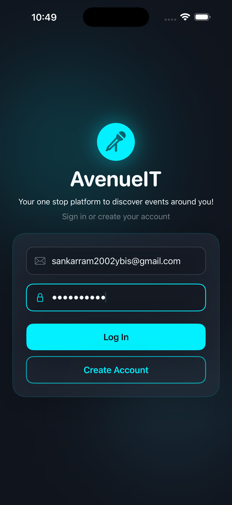
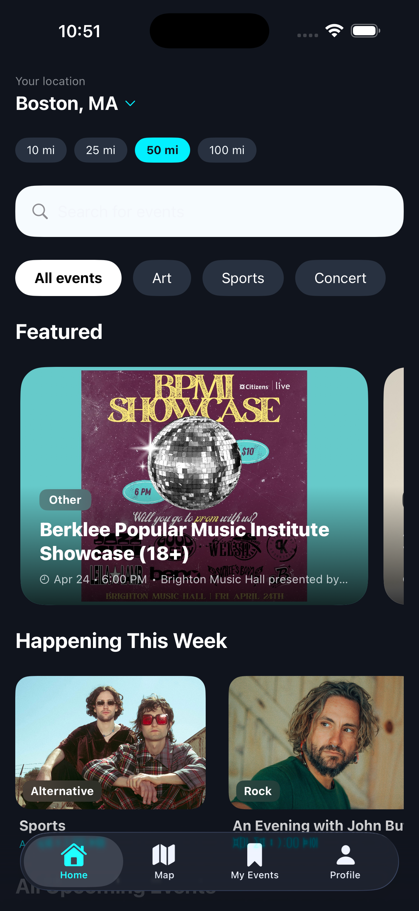
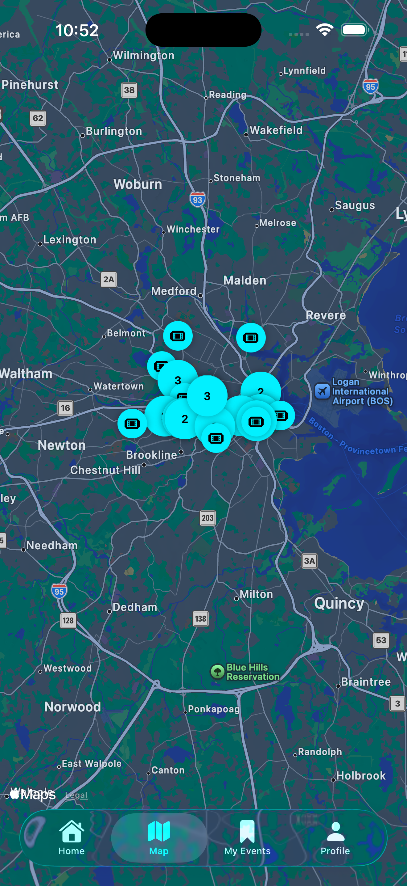

# AvenueIT

**AvenueIT** is an iOS event discovery app that uses your device's GPS to show concerts, sports, art shows happening near you using the Ticketmaster API. Users can browse events on a home feed or interactive map, save favourites, and buy tickets directly through the app.

---

## Key Technologies

- **Firebase Authentication** — email/password login and account creation
- **Ticketmaster Discovery API + JSON Decoding** — fetches paginated live event data by GPS coordinate and radius
- **Apple MapKit** — interactive map with clustered venue pins
- **Apple CoreLocation** — device GPS with reverse geocoding and ZIP code override
- **MVVM Architecture** — `EventsViewModel`, `SavedEventsViewModel`, `LocationManager` as `@Observable` classes
- **Custom `Codable` Structs** — full model layer for decoding nested Ticketmaster JSON responses
- **`@AppStorage`** — persists user preferences (login state, search radius, profile info)
- **`@State` / `@Environment`** — data passing between views and tabs
- **Pagination** — infinite scroll with page tracking against the Ticketmaster API

---

## Screenshots

| Login | Home Feed | Map View |
|-------|-----------|----------|
|  |  |  |

---

## Demo Video

---

## Contact

**Sankar Ram Subramanian** — MCAS Class of '26, Boston College, Exchange Student from National University of Singapore

- LinkedIn: [linkedin.com/in/sankar-ram-subramanian](https://www.linkedin.com/in/sankarram-subramanian)
- Email: sankarram2002ybis@gmail.com
